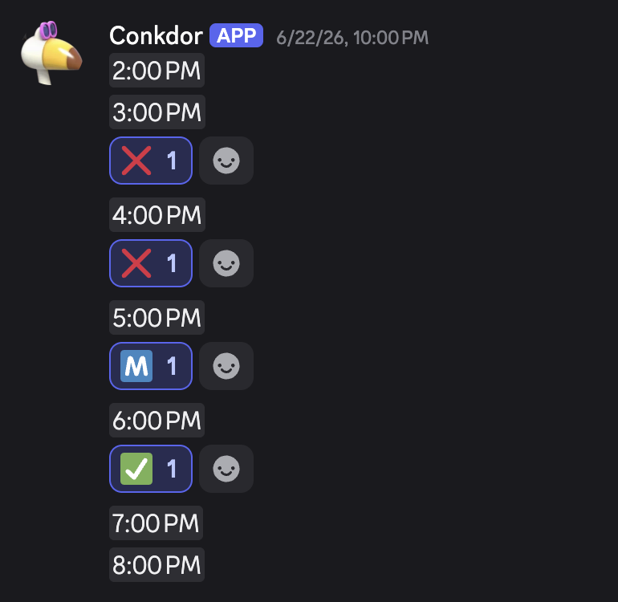

# Conkdor Bot

A discord bot for managing a daily gathing channel.


- Times are converted to user's local timezone.
- Automatically resets the reactions at the end of the day.
- You can still send messages in the gathers channel, and they will be deleted when the gathers are reset.
- Option to add a reminder.
- Collects stats about your server's gathers.

---

## Invite

The bot can be inviting from a mutual server using the "+ Add App" button in the bot's profile. Or you can invite it using the link below

[https://discord.com/oauth2/authorize?client_id=1503624392192557127&permissions=412317379648&integration_type=0&scope=bot](https://discord.com/oauth2/authorize?client_id=1503624392192557127&permissions=412317379648&integration_type=0&scope=bot)

## Setup

**Warning: the bot will fully clear the channel where gathers are set up. You will lose all the messages in that channel. Only setup gathers in a channel dedicated to gathering, and note that it will clear the messages every day.**

Navigate to the channel where you would like to setup gathers and run ```/setup_gathers```. Parameters:
- ```start_time```, ```end_time``` The first and last gather times. The bot will post a timestamp for each hour inbetween, including the start and end time.
- ```message``` Message to send at the end of the gathers. It is optional.
- ```reminder_time``` and ```reminder_message``` Can be used to send a reminder message at a custom time. Note that both fields need to be filled out for the reminder to work.

Once the gathers are set, the bot should send a list of settings. Make sure they look correct. 

To create the list of gathers right away, use ```/manual_reset```. It will clear the channel and post the gather times. Otherwise, the bot will wait until the reset time (one hour after the last gather time) to post the first gathers.

If you want to change the settings later, use ```/setup_gathers``` again. Be sure to fill out all the settings you need again, because it will completely overwrite the old settings.

It is possible to set up more than one gather channel in a single server.

## Viewing gather stats
The bot stores some information about reactions every time it resets a channel. Use ```/gathers_stats```. Parameters:
- ```emoji``` The reaction emoji to show reaction data for.
- ```start_date```, ```end_date``` Set a custom date range to show stats for. Defaults to all time.

## Other Commands

- ```/view_settings``` Show the gather settings for this channel. Only works in a channel where gathers are setup.
- ```/find_gather_channels``` Shows the channel(s) where gathers are setup in the server.
- ```/remove_gathers``` Removes the gathers in the current channel. The bot will stop resetting gathers every day and the channel will go back to "normal".
- ```/manual_reset``` Reset the gathers in the current channel right now. Note that this reset will NOT count towards gather stats.
- ```/next_00``` See what the next top-of-the-hour (:00) is in major time zones. Works in any channel and is useful for converting timezones.

